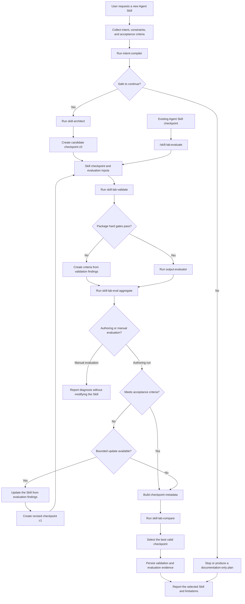

# Skill Lab

Claude Code plugin for designing, evaluating, diagnosing, and improving Agent Skills.

Skill Lab is a thin workflow-orchestration plugin: reusable domain core as portable Agent Skills, independent reasoning via Claude Code subagents, and objective checks via deterministic scripts (`bash` + `jq`).

## End-to-end workflow

Evaluation is not an independent authoring step. It consumes a concrete Agent
Skill checkpoint produced by creation or a bounded update. A manual
`/skill-lab:evaluate` run also requires an existing Skill directory containing
`SKILL.md`; it cannot run without that input artifact.



The dependency is the Skill checkpoint itself. The create workflow evaluates
`c0`, may use its evidence to produce one revised checkpoint `c1`, and then
evaluates `c1` before comparing checkpoints. A standalone evaluation starts
from an existing checkpoint and remains non-mutating. A failed hard gate cannot
be offset by a high average score.

## Repository layout

```text
.
├── plugins/
│   └── skill-lab/           # Product plugin
├── integration_tests/       # Shared plugin smoke tests
├── docs/                    # RFC and architecture notes
├── .claude-plugin/          # Claude marketplace (active)
├── .cursor-plugin/          # Cursor marketplace (empty until adapter)
├── .codex-plugin/           # Codex marketplace (empty until adapter)
└── Makefile
```

MVP installs via the **Claude** marketplace only. Cursor/Codex marketplace manifests are reserved with empty `plugins` until platform adapters ship.

## Quickstart

1. Install from the Claude marketplace (or load with `--plugin-dir plugins/skill-lab`).
2. Run `/skill-lab:create` with a short skill request, or `/skill-lab:evaluate path/to/skill`.
3. Local checks:

```bash
./plugins/skill-lab/tests/unit/test-cli.sh
./integration_tests/run.sh --manifest-only --verbose
```

## Plugin features (MVP)

| Surface              | Purpose                                                                     |
| -------------------- | --------------------------------------------------------------------------- |
| `create` skill       | Intent → candidate → validate → evaluate → one update → best checkpoint     |
| `evaluate` skill     | Evaluate an existing Skill checkpoint without modifying it                  |
| `intent-compiler`    | Structured intent contract                                                  |
| `skill-architect`    | Portable package generation                                                 |
| `output-evaluator`   | Independent rubric assessment                                               |
| `skill-lab-validate` | Deterministic package + eval structure checks                               |
| `skill-lab-eval`     | Eval schema checks + score aggregation                                      |
| `skill-lab-compare`  | Best-valid-checkpoint selection                                             |

## Development

See [CONTRIBUTING.md](CONTRIBUTING.md) and [plugins/skill-lab/README.md](plugins/skill-lab/README.md).

Integration tests auto-discover plugins under `plugins/` that contain `.claude-plugin/plugin.json`.

```bash
make lint
make test-integration-docker
```

## License

Apache License 2.0. See [LICENSE](LICENSE).