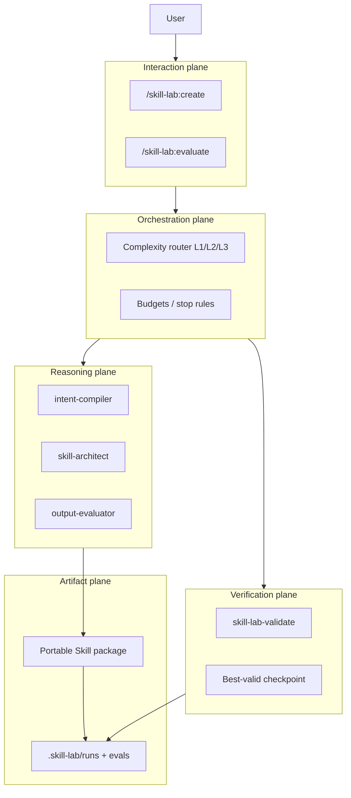

# Skill Lab RFC

| Field | Value |
| --- | --- |
| **Status** | Accepted for Phase 0 (contracts frozen; MVP planned) |
| **Date** | 2026-07-24 |
| **Repo** | [yu-iskw/skill-lab](https://github.com/yu-iskw/skill-lab) |

> **Supersession note.** The full original draft narrative is superseded by this accepted RFC plus [ADR 0001](decisions/0001-mvp-open-question-defaults.md) and the [MVP plan](superpowers/plans/2026-07-24-skill-lab-mvp.md) for implementation purposes. Normative MUST/SHALL rules below remain binding.

---

## Monorepo Amendment (binding)

This repository is a **Claude plugin monorepo**, not a greenfield flat Skill Lab tree. Placement SHALL be:

| Concern | Path |
| --- | --- |
| Product plugin | `plugins/skill-lab/` |
| Frozen contracts / JSON Schemas | `docs/contracts/schemas/` (source of truth; plugin may copy) |
| Sample plugin | Retain `plugins/hello-world/` unless a later ADR removes it |

Skill Lab product self-evals live under `plugins/skill-lab/evals/`. Generated portable Skills MUST NOT embed `.claude-plugin/` manifests.

**Binding companions:**

- [ADR 0001 — MVP open-question defaults](decisions/0001-mvp-open-question-defaults.md)
- [MVP implementation plan](superpowers/plans/2026-07-24-skill-lab-mvp.md)
- [Scenario validation](architecture/rfc-scenario-validation.md)

---

## 1. Executive summary — Approach D

**Decision:** Implement Skill Lab as a **hybrid Claude Code plugin** (Approach D):

1. **Workflow skills** orchestrate user-facing flows (`create`, `evaluate`; later `improve`, …).
2. **Subagents** isolate judgment and generation (`intent-compiler`, `skill-architect`, `output-evaluator`; later trigger/adversarial/repair roles).
3. **Deterministic scripts / CLI** enforce hard gates (`skill-lab-validate`), scoring aggregation, and best-valid-checkpoint selection.

Rejected alternatives (from the original decision matrix):

- **A** — one monolithic meta-Skill (weak evaluator independence; hard to test).
- **B** — workflow Skills only, no subagents (maker/evaluator share context).
- **C** — subagent-first for every task (cost and agent-theater risk on simple Skills).
- **E** — hosted Skill CI / registry (premature infrastructure).

Approach D keeps **portable Agent Skills** as the artifact unit and confines Claude-specific packaging to `plugins/skill-lab/`.

---

## 2. Goals

Skill Lab SHALL:

1. Help authors **create** minimal, valid Agent Skills from natural-language intent.
2. **Evaluate** existing Skills with observable evidence and non-mutating judges.
3. Separate **hard gates** (deterministic, blocking) from **quality** scores (soft, may need human accept).
4. Bound **repair** loops; select the **best valid checkpoint**, never a high-scoring invalid one.
5. Keep generated Skills **host-portable** (`SKILL.md` + optional `references/`, `scripts/`, `assets/`, `evals/`).
6. Persist run evidence under `.skill-lab/runs/` without inventing tokens/cost.

## 3. Non-goals (MVP)

MVP MUST NOT require:

- Hosted registry, web UI, or autonomous publishing / PR merge.
- Codex eval parity (Phase 4 at earliest).
- Untrusted Skill script **execution** during validate (static checks only).
- Crawling `~/.claude` for neighbor Skills.
- Python-first CLI or dual-language core.
- Full `improve` / trigger-diagnosis autonomy (evaluate-only degradation is correct).

---

## 4. Design principles

1. **Judgment ≠ mutation.** Evaluators MUST NOT write Skill packages; architects mutate only under create/repair budgets.
2. **Hard gates dominate.** Any hard failure invalidates a checkpoint regardless of average quality score.
3. **Minimal artifacts.** Emit only what `complexity_level` / `artifact_budget` justify.
4. **Progressive disclosure.** Workflow skills orchestrate; they MUST NOT paste full rubrics/encyclopedias into every turn.
5. **Evidence or silence.** Completion claims MUST be traceable to run records / criterion evidence.
6. **Human for irreversible & subjective accept.** L2/L3 distribution accept and security waives require human approval.
7. **Portable core, host adapters.** Claude plugin wiring stays in the plugin; generated Skills stay Agent-Skills-portable.

---

## 5. Five planes



| Plane | Responsibility |
| --- | --- |
| **Interaction** | User-facing workflow skills; slash commands; human gates. |
| **Orchestration** | Route by complexity; enforce budgets; order eval vs repair; stop reasons. |
| **Reasoning** | Subagents for intent, package authorship, soft judgment. |
| **Verification** | Schema/static/security hard gates; score aggregation; checkpoint select. |
| **Artifacts** | Portable Skill trees, curated `evals/`, run manifests and evidence. |

---

## 6. Component responsibilities (MVP)

| Component | Plane | MUST | MUST NOT |
| --- | --- | --- | --- |
| `create` skill | Interaction/Orchestration | Compile → route → architect → validate → ≤1 repair → select checkpoint → report | Silently overwrite installed Skills without an improve contract |
| `evaluate` skill | Interaction/Orchestration | Load path; validate; soft-eval as allowed; write `.skill-lab/runs/` | Mutate the target Skill |
| `intent-compiler` | Reasoning | Emit `skill-state` (`schema_version` `1.0.0`); set `complexity_level` ∈ {1,2,3} and `artifact_budget`; list assumptions & irreversible actions | Invent unjustified artifacts |
| `skill-architect` | Reasoning | Write minimal portable package under target path; produce checkpoints | Embed `.claude-plugin/` in generated Skills; self-grade as pass |
| `output-evaluator` | Reasoning | Score criteria with evidence; record judge model id | Write/Edit Skill files or expected eval outputs |
| `skill-lab-validate` | Verification | Enforce Appendix B hard gates; emit structured findings | Execute untrusted Skill scripts (MVP) |

**Deferred (post-MVP):** workflows `improve`, `diagnose-trigger`, `extract-from-session`; agents `trigger-evaluator`, `adversarial-reviewer`, `repair-planner`; hooks; MCP; Codex adapter; execution sandbox.

---

## 7. Portable core vs adapters

**Portable Skill (artifact):**

```text
skills/<name>/
  SKILL.md                 # required
  references/              # if artifact_budget.allow_references
  scripts/                 # if artifact_budget.allow_scripts
  assets/                  # if artifact_budget.allow_assets
  evals/                   # curated suites (Appendix A.2 default)
```

**Adapter (Skill Lab plugin):** `plugins/skill-lab/` — workflow skills, agents, validators, plugin manifest, product self-evals. Host-specific config (judge model pin, install via `--plugin-dir`) lives here, not inside generated Skills.

---

## 8. Complexity levels

`intent-compiler` SHALL emit `complexity_level`:

| Level | When | Artifact posture | Accept posture |
| --- | --- | --- | --- |
| **L1** | Deterministic I/O, structural checks | Thin: usually `SKILL.md` (+ tiny `scripts/` only if justified) | Hard gates; soft judge optional |
| **L2** | Subjective quality / rubrics | `SKILL.md` + curated `evals/`; soft scores required | **Human approval** before distribution accept |
| **L3** | Multi-artifact / app-dev workflows | Richer package (`references/`, optional `scripts/`, `evals/`) | Hard gates strict; soft + **human** first accept; security review when scripts present |

Downstream agents MUST NOT invent artifacts the level / `artifact_budget` does not justify.

---

## 9. Evaluation order

For each checkpoint, orchestration SHALL:

1. Run **Verification** hard gates (Appendix B). If any fail → `hard_gates_passed=false`; checkpoint **invalid**.
2. Run allowed **quality** assertions / `output-evaluator` rubrics; record criterion evidence (`severity`: `hard` | `quality`).
3. Aggregate `overall_score` only as informational for **valid** checkpoints.
4. Persist results under `.skill-lab/runs/<run-id>/` per run-manifest / evaluation-result contracts.
5. Select **best valid** checkpoint (highest score among `hard_gates_passed=true`). If none valid → stop with `hard_gate_failed` (or escalate).

Tokens/cost fields MAY be present but MUST remain `null` unless host-exposed; implementations MUST NOT invent estimates.

---

## 10. Repair defaults

| Rule | Normative default | MVP override |
| --- | --- | --- |
| `budgets.max_iterations` | 3 (full product default; deferred) | **1** |
| Repair triggers | Hard-gate failures / missing required eval stubs | Same |
| Soft-score chasing | MUST NOT drive unbounded rewrite loops | Same |
| After budget | Stop; report; escalate to human if needed | Same |
| Selection | Best **valid** checkpoint | Same |

Stop reasons include: `target_reached`, `budget_exhausted`, `plateau`, `same_failure_repeated`, `human_required`, `hard_gate_failed`, `completed`.

---

## 11. Security

1. MVP package validation SHALL be **schema + static** only; it MUST NOT execute untrusted Skill scripts by default.
2. **Dangerous-script static hard gate is MVP-critical** (network exfil patterns, destructive shell, writes under `$HOME`, etc.) → hard fail with file/line evidence.
3. `evaluate` / `output-evaluator` MAY score textual fixtures without invoking Skill scripts.
4. Waiving a security hard fail REQUIRES explicit human approval; default CI posture is **no waive**.
5. Persisted runs MUST NOT store secrets; raw traces SHOULD be gitignored.
6. Post-MVP execution adapters (if any): Docker, non-root, `--network=none`.

---

## 12. Persistence (§21 summary)

Under `.skill-lab/runs/<run-id>/`, persist: scores, hashes, timings, tool-use summaries, short rationales, criterion evidence, run manifest, selected checkpoint.

- Generated Skills and curated `evals/` SHOULD be version-controlled.
- Raw traces SHOULD NOT be version-controlled by default.

---

## 13. Contracts

Frozen at `schema_version` **`1.0.0`** in `docs/contracts/schemas/`:

- `skill-state.schema.json`
- `run-manifest.schema.json`
- `evaluation-result.schema.json`
- `trigger-eval.schema.json`
- `output-eval.schema.json`

**Evolution (ADR 0001):** additive anytime; breaking only with ≥20 fixtures across ≥3 fixture Skills **and** a `schema_version` bump.

**Eval location (Appendix A.2):** curated evals for generated Skills live **inside** the Skill package at `evals/`. Product self-tests: `plugins/skill-lab/evals/`.

---

## 14. MVP scope (§26)

### §26.1 In scope

- Plugin at `plugins/skill-lab/` with `create` + `evaluate`.
- Agents: `intent-compiler`, `skill-architect`, `output-evaluator`.
- TypeScript Node 20+ validator CLI (`skill-lab-validate`) with Appendix B gates including dangerous-script static scan.
- Contracts above; three fixture Skills (deterministic, subjective writing, boundary/security).
- Project-local / `--plugin-dir` install; sibling `skills/` discovery (+ optional `--also`).
- MVP repair: `max_iterations = 1`.

### §26.2 Out of scope

Listed in §3 and deferred components in §6.

### §26.3 Success criteria

1. Novice request → valid minimal Skill via create path.
2. Existing Skill evaluated **without mutation**.
3. Deterministic failures reported with evidence.
4. Subjective evaluation runs in a **separate** agent context.
5. Hard-gate failures are **not** offset by aggregate score.
6. Best valid checkpoint is selected.
7. Completion report claims are traceable to run evidence.

### §25.1 Fixture priority (implementation)

Prioritize: (1) minimal deterministic, (2) subjective writing, (5) boundary/dangerous-script; coding Skill MAY slip to Phase 2 if time-boxed.

---

## 15. Decision (§31)

**Accepted:** Approach D hybrid plugin architecture, with monorepo amendment above.

**Phase 0 complete when:** this RFC is landed, ADR 0001 pins open questions, schemas are frozen under `docs/contracts/schemas/`, scenario paper-validation covers create/evaluate/security (and correctly defers improve), and the MVP plan is reviewable.

**Next:** implement MVP per [2026-07-24-skill-lab-mvp.md](superpowers/plans/2026-07-24-skill-lab-mvp.md) without inventing architecture that conflicts with Approach D.

---

## Appendix B — Hard gates (summary)

All of the following are **blocking** (`severity: hard`). Failure ⇒ checkpoint invalid.

| Gate | Rule |
| --- | --- |
| Package root | Target directory contains `SKILL.md` |
| Frontmatter | YAML includes `name` and `description` |
| Name ↔ dir | Frontmatter `name` equals directory name |
| Name pattern | `^[a-z0-9]+(?:-[a-z0-9]+)*$` (Agent Skills naming) |
| Description length | ≤ 1024 characters |
| Layout | No undeclared / disallowed top-level dirs for the declared budget |
| Eval schema | Optional eval JSON validates against frozen schemas |
| Eval IDs | No duplicate case/assertion IDs |
| Fixtures | Declared fixture paths exist |
| L3 shape | When `complexity_level=3`, required package/eval presence per compiler budget |
| Dangerous scripts | Static scan findings (network, destructive shell, `$HOME` writes, etc.) |
| Portability | Generated Skill MUST NOT contain `.claude-plugin/` |

Quality/`llm-rubric` scores are **non-blocking** unless an assertion explicitly sets `severity: hard`. Soft accept for L2/L3 distribution still REQUIRES human approval (§8).
