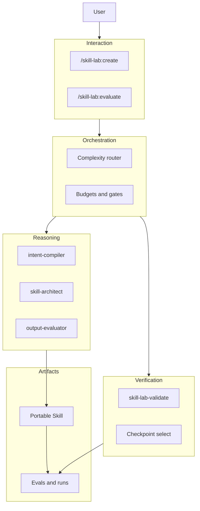

# Skill Lab — Architecture Overview

Skill Lab is a Claude Code plugin that engineers Agent Skills through a hybrid of workflow skills, subagents, and deterministic scripts (RFC Approach D).

## Five planes

## MVP vs later

| Included in MVP | Deferred |
| --- | --- |
| create, evaluate | improve, diagnose-trigger, extract-from-session |
| intent-compiler, skill-architect, output-evaluator | trigger-evaluator, adversarial-reviewer, repair-planner |
| Static validate + dangerous-script hard gate | Script execution sandbox |
| One repair iteration | Full repair loop defaults (3) |
| Claude Code plugin | Codex eval parity |

## Contract source of truth

JSON Schemas (`schema_version` `1.0.0`) live in [`docs/contracts/schemas/`](../contracts/schemas/).

## Further reading

- [RFC](../RFC.md)
- [ADR 0001 — open-question defaults](../decisions/0001-mvp-open-question-defaults.md)
- [Scenario validation](rfc-scenario-validation.md)
- [MVP implementation plan](../superpowers/plans/2026-07-24-skill-lab-mvp.md)
